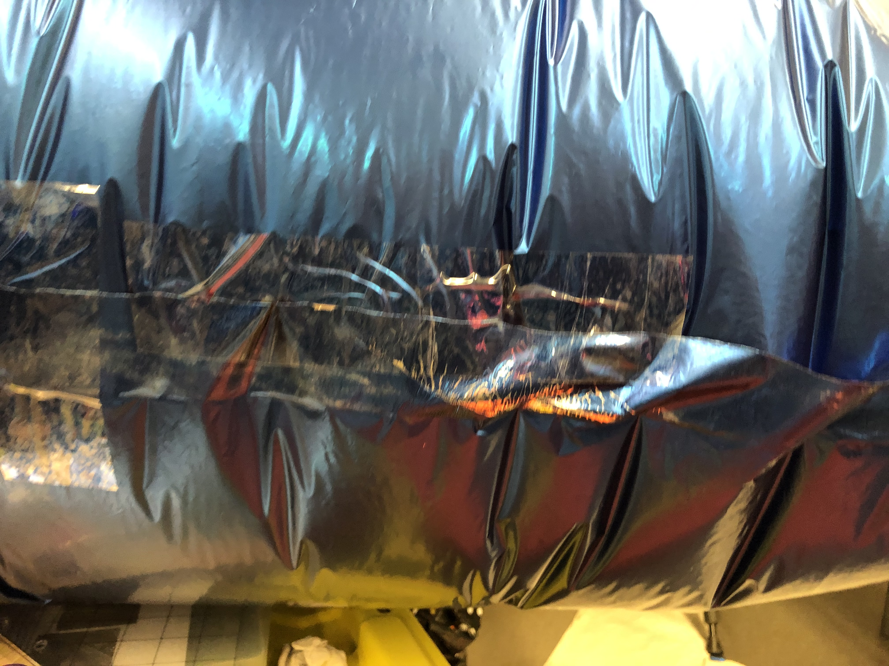
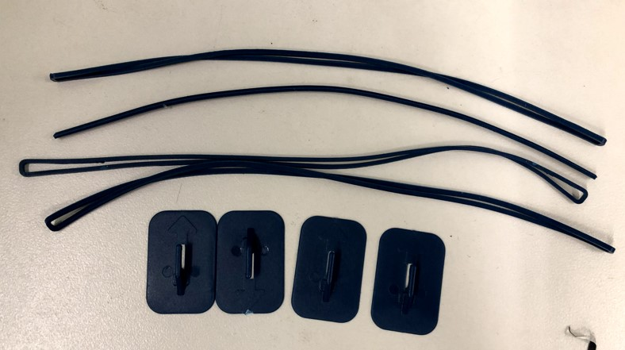

# Blimp assembly document

## Content

1. Inflate balloon
2. Assemble components on balloon
3. Assemble the capture mechanism

## 1. Inflate balloon

- The deflated balloons are shown in the following pictures, you can insert the helium nozzle into the tube and inflate these balloons. 

- While you are inflating these balloons, it would be better to have two people for this job. One inflates the balloon and one holds the other side of the balloon. 

## 2. Assemble components on balloon

There are four main parts of the balloon:

1. Gondola that has control board, vertical motors, searching camera.

2. Tail actuator

3. Front camera

4. Capture mechanism

5. Fins
6. Ballast

The illustration figure is shown as follows: 

### Step 1: Assemble gondola 

- Flatten the bottom of the balloon using the scotch-tape

  

  

  

- Eventually the bottom of the blimp should be like this:

  
  
- Put the velcro tape on the bottom of the balloon like this:

  

- Tape the gondola with velcro tape and attach gondola onto the balloon. **However, this is still not stable enough. Use the scotch tape to pass through the gondola and secure the gondola to the bottom of the balloon.**

  

### Step 2: Stabilize the tail actuator

- Use the rubber band and positioning plate like below:

  

- Flatten the back of the balloon like the following pictures:

  

- Attach the positioning plate on the right place

  

- Stabilize the tail actuator on the back of the balloon

  

### Step 3: Assemble the capture mechanism 

- Finish the capture mechanism first

- Assemble the capture mechanism on the front of the balloon like this:

  

- Remember: this is still not stable enough, use as many as scotch tape as you can to secure the capture mechanism on the front of the balloon. 

### Step 4: Assemble the front camera

- Assemble the front camera on the nose of the balloon and point to the right direction

  

### Step 5: Attach the fins

- Attach the 4 fins on the tail of the balloon

  

  

### Step 6: Balance the balloon using ballast

- After finish the assembly, the balloon is still positive buoyancy

- Now we need to use ballast to make sure the whole balloon to reach the neutral buoyancy. Just like this:

  

  

### Step 7: Wiring

- Before wire the the tail motor and servo to the gondola, the wire connection on the gondola should be something like this. The camera servo has already connected to the control board.

  

- Now wire the tail motor to the gondola using the following figure:

  

- If one vertical motor is not powerful enough to provide the vertical thrust. Then connect two motors to both A1,A2 and B1,B2 on the first motor driver. 

### Step 8: stabilize other wires

Use scotch tape to attach the wire on the balloon like this: 

## Step 9: Put batteries into the gondola

Insert batteries like the following pictures:

After the system battery(The big one) and search camera battery is inserted into the gondola, use a piece of paper to seal the gondola like the following pictures:

## 3. Assemble the capture mechanism

### The overall picture:

### Some details: 

The plastic wrap should circle around the edge of capture mechanism

The width of the plastic wrap should not be too wide, other wise the green ball won't get into the cage.

