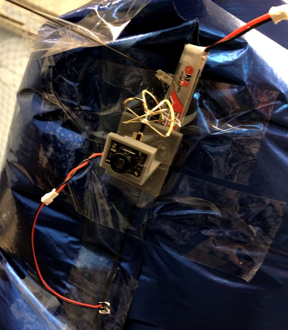
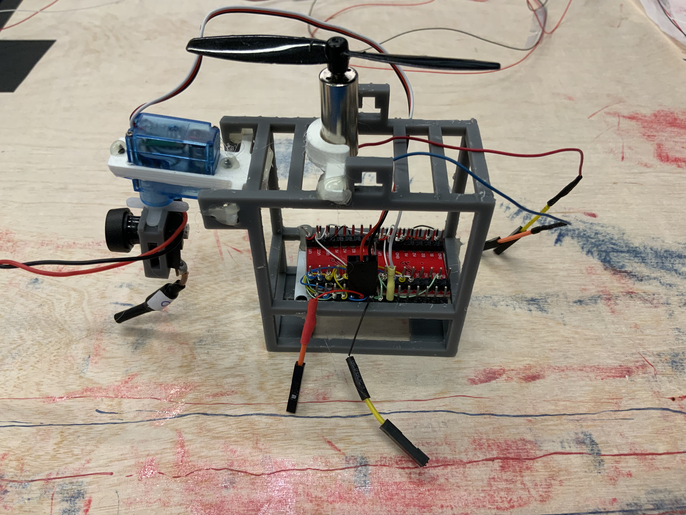
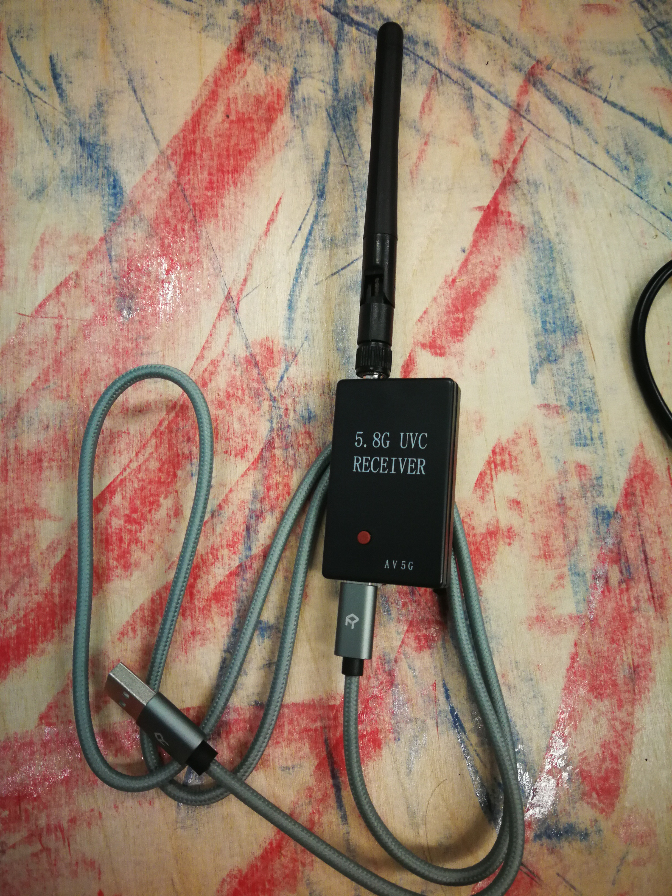
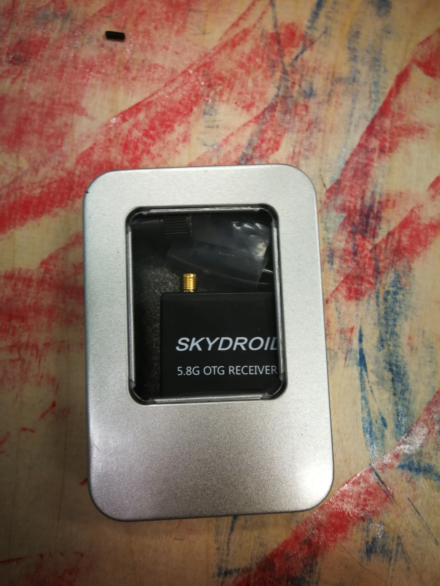
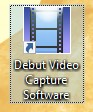
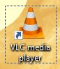
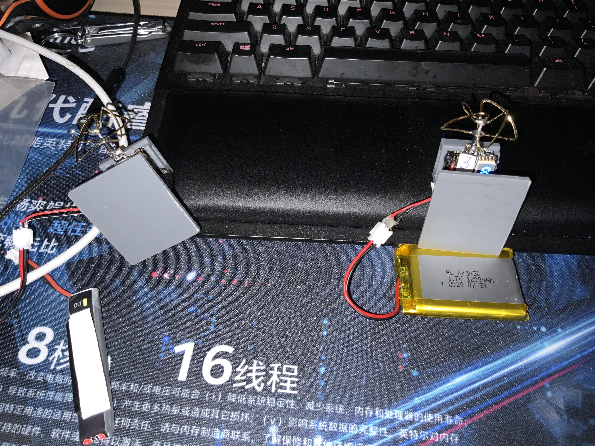
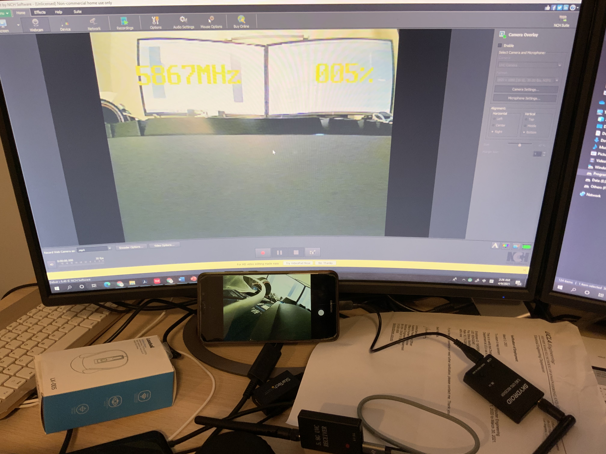

# Camera data

## Content 

- Hardware introduction
- Software introduction
- What you will see after setup finish
- How to record data

## Hardware introduction

### Camera introduction

In our blimp, we have two cameras. One is on the nose of blimp and the other is with the gondola, which is the searching camera.

As you can see from the figures:





### Receiver introduction

In the Toolbox, we provided 3 different types of receivers:

- The one that has a 4 inches monitor

- The one that can be connected directly to laptop:

  

- The one that can connect to Android cellphone with OTG function

  

## Software introduction

In the competition, we will use the first monitor FPV cam receiver to quickly search and display the camera image. And we will use the other two types of receivers to record the data we need.  

- The first type of receiver doesn't require any software.

- The one that connect to laptop require software:

  - For **windows**, you can use [Debut video capture](https://www.nchsoftware.com/capture/index.html) or  [VLC media player](https://get.videolan.org/vlc/3.0.12/win32/vlc-3.0.12-win32.exe) 

  - For **Linux**, you can install [VLC media player](https://www.videolan.org/vlc/download-ubuntu.html)

  - For MAC, you can find [Debut Video Capture Software](https://apps.apple.com/us/app/debut-video-capture-software/id913592132?mt=12) from app store or [VLC media player](https://www.videolan.org/vlc/download-macosx.html)

  - There icon after installation: 

     or 

- The one that connect to Android cellphone with OTG function:
  - You can find [Skydroid FPV](https://play.google.com/store/apps/details?id=com.shenyaocn.android.fuavg&hl=en_US&gl=US) from GOOGLE PLAY

## What you will see after setup finish

To power the FPV camera:



The image from your laptop and cellphone:



## How to record data

- For windows, you can use the system screen recorder:
  -  Win+G to activate 

- For Ubuntu, you can install SimpleScreenRecorder:

  - To install the latest version of SimpleScreenRecorder in Ubuntu-based Linux distributions, you can also use the official PPA. Use the following commands in the terminal:

  - ```
    sudo add-apt-repository ppa:maarten-baert/simplescreenrecorder
    sudo apt update
    sudo apt install simplescreenrecorder
    ```


